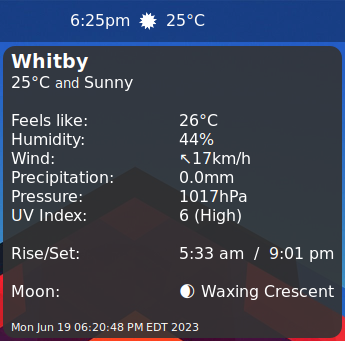
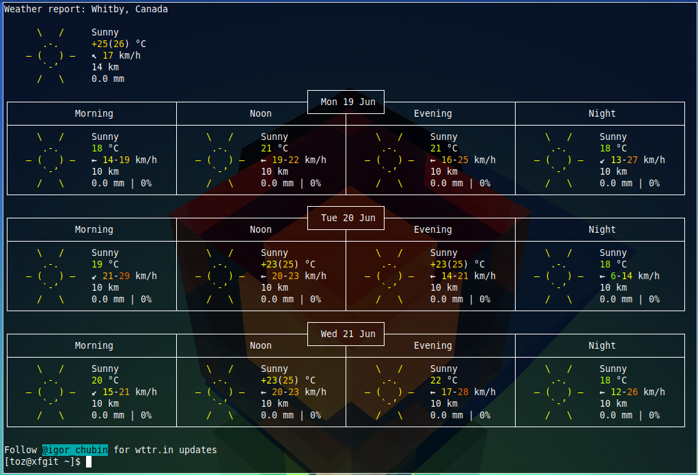

# weather
This is a genmon script to query and display weather data from wttr.in (https://github.com/chubin/wttr.in) on the xfce4-panel.

<b>Requires:</b> curl & weather icons (https://github.com/kevin-hanselman/xfce4-weather-mono-icons) - icons incuded here

<b>Note:</b> depending on the font your are using, you may need to adjust the number of "\t" (tabs) in the tooltip string to get the readings to line up properly.

<b>How To:</b>

1. Add the genmon plugin to the panel
2. set in it's properties:
  - command = /path/to/script SITE LATITUDE LONGITUDE
    - SITE is the name of your town/city, latitude/longitude hopefully self explanatory
  - uncheck label
  - period = 10,800
3. click on Save

<b>Screens:</b>

